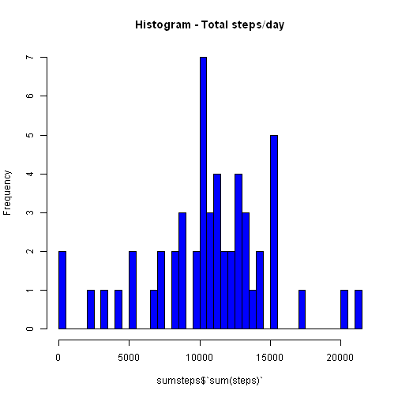
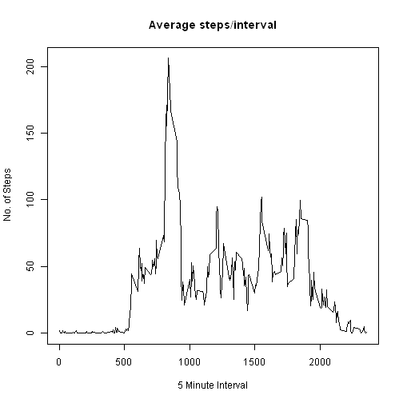
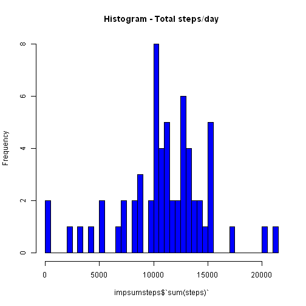
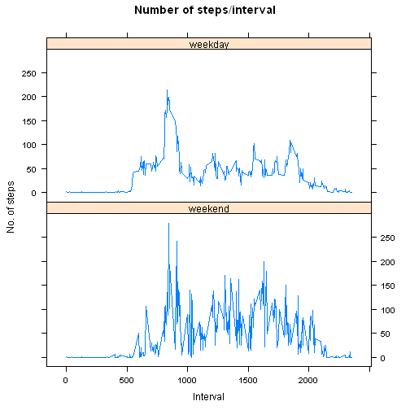

#Coursera - Reproducible Research
##John Hopkins University
##Assignment 1 - Peder Lewenhaupt

The following is a report containing answers to questions specified in the assignment. 

##1. Loading and preprocessing the data
First, the data were downloaded and imported into R. 


```r
u <- "https://d396qusza40orc.cloudfront.net/repdata%2Fdata%2Factivity.zip"
filename <- basename(u)
download.file(u, filename)
unzip(filename)
actdata <- read.csv("activity.csv", header = T)
```

##2. What is mean total number of steps taken per day?
To answer the question, some calculations were necessary, using the dplyr-package. The package was loaded, after which the total number of steps, and the mean and median steps per day were calculated. See histogram of the former. The mean steps per day was 10766 and the median was 10765.  


```r
library(dplyr)
```

```
## 
## Attaching package: 'dplyr'
```

```
## The following objects are masked from 'package:stats':
## 
##     filter, lag
```

```
## The following objects are masked from 'package:base':
## 
##     intersect, setdiff, setequal, union
```

```r
sumsteps <- actdata %>% group_by(date) %>% summarise(sum(steps))

#Find mean and median of total steps/day
meanstepsday <- mean(sumsteps$`sum(steps)`, na.rm = T)
meanstepsday
```

```
## [1] 10766.19
```

```r
medianstepsday <- median(sumsteps$`sum(steps)`, na.rm = T)
medianstepsday
```

```
## [1] 10765
```

Here is the histogram:


```r
hist(sumsteps$`sum(steps)`, breaks = 61, col = "blue", main = "Histogram - Total steps/day")
```



##3. What is the average daily activity pattern?
To answer this question, dplyr was used to find the mean of every 5-minute interval, like so:


```r
meanint <- actdata %>% group_by(interval) %>% summarise(mean(steps, na.rm = T))
```

Then, a line plot of the time series:


```r
plot(meanint, type = "l", main = "Average steps/interval", xlab = "5 Minute Interval", ylab = "No. of Steps")
```



Lastly, the interval with the maximum mean was calculated:

```r
maxind <- which.max(meanint$`mean(steps, na.rm = T)`)
meanint[maxind,]
```

```
## # A tibble: 1 × 2
##   interval `mean(steps, na.rm = T)`
##      <int>                    <dbl>
## 1      835                 206.1698
```


##4. Imputing missing values
For the imputation, a slightly more advanced method then suggested was used. The mice-package was employed and the missing values were imputed using predictive mean modelling. 

First, the total number of missing values was found:

```r
nas <- sum(is.na(actdata))
```

Then, the mice-package was loaded and the missing values were imputed.


```r
library(mice)

init <- mice(actdata, maxit=0) 
meth <- init$method
predM <- init$predictorMatrix

predM[, c("date")]=0
meth[c("steps")]="pmm" 
set.seed(500)
imputed = mice(actdata, method=meth, predictorMatrix=predM, m=5)
```

```
## 
##  iter imp variable
##   1   1  steps
##   1   2  steps
##   1   3  steps
##   1   4  steps
##   1   5  steps
##   2   1  steps
##   2   2  steps
##   2   3  steps
##   2   4  steps
##   2   5  steps
##   3   1  steps
##   3   2  steps
##   3   3  steps
##   3   4  steps
##   3   5  steps
##   4   1  steps
##   4   2  steps
##   4   3  steps
##   4   4  steps
##   4   5  steps
##   5   1  steps
##   5   2  steps
##   5   3  steps
##   5   4  steps
##   5   5  steps
```

```r
imputed <- complete(imputed)
```

After this, the total sum of steps after imputation was calculated, and histogram created:


```r
impsumsteps <- imputed %>% group_by(date) %>% summarise(sum(steps))

hist(impsumsteps$`sum(steps)`, breaks = 61, col = "blue", main = "Histogram - Total steps/day")
```



Also, the mean and median of the new, imputed data were calculated, as was the difference between the previous, unimputed data and the new data:


```r
impmeanstepsday <- mean(impsumsteps$`sum(steps)`, na.rm = T)
impmeanstepsday
```

```
## [1] 10976.15
```

```r
impmedianstepsday <- median(impsumsteps$`sum(steps)`, na.rm = T)
impmedianstepsday
```

```
## [1] 11162
```

```r
meanstepsday - impmeanstepsday
```

```
## [1] -209.9589
```

```r
medianstepsday - impmedianstepsday
```

```
## [1] -397
```

##5. Are there differences in activity patterns between weekdays and weekends?
To answer this question, a new variable was added to the new dataset, specifying if the date was a weekday or weekend. This was done using the lubridate and dplyr packages. 


```r
library(lubridate)
```

```
## 
## Attaching package: 'lubridate'
```

```
## The following object is masked from 'package:base':
## 
##     date
```

```r
imputed$date <- ymd(imputed[,2])

#Create weekday/end (weekd) variable and mean df. 
newimpdata <- imputed %>% mutate(weekd = ifelse(wday(imputed$date) == c(1, 7), "weekend", "weekday"))
```

Next, the mean steps of intervals on weekdays and weekends were calculated and comparative plots generated through the lattice package:


```r
impmeanint <- newimpdata %>% group_by(interval, weekd) %>% summarise(steps = mean(steps))

library(lattice)

lattice.options(default.args = list(as.table = TRUE))
xyplot(steps ~ interval | weekd, data = impmeanint, layout = c(1, 2), main = "Number of steps/interval", xlab = "Interval", ylab = "No. of steps", type = "l")
```



Et voilà, c'est fini!
